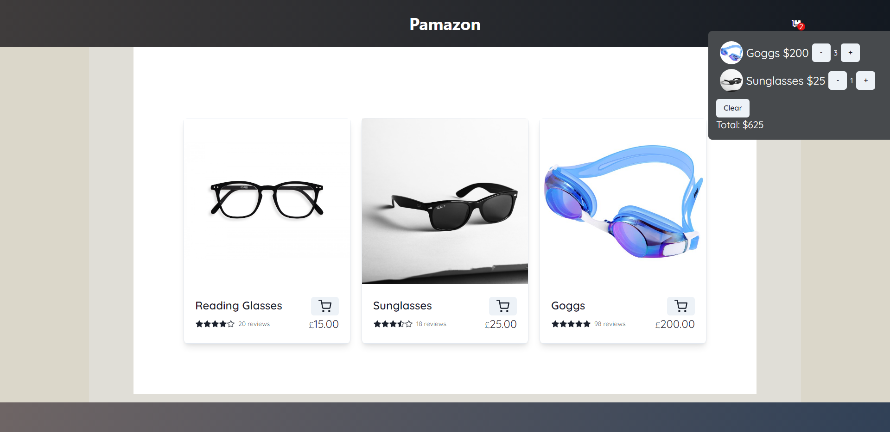

# demo-shop-app

Live at https://shop.paethos.me

This is a small ecommerce shop project I made using React, Redux, Node.js, and Express.  
A User can add various products/quanties to a responsive shopping cart that fetches a  
list of products from my server.
React was used for the front end of the website and Redux was used to manage the global  
cart state. 
I used express to serve a JSON file of products that contain: ID, name, price, img src,  
and mock user ratings. 

Thanks for reading!

# Home Page

